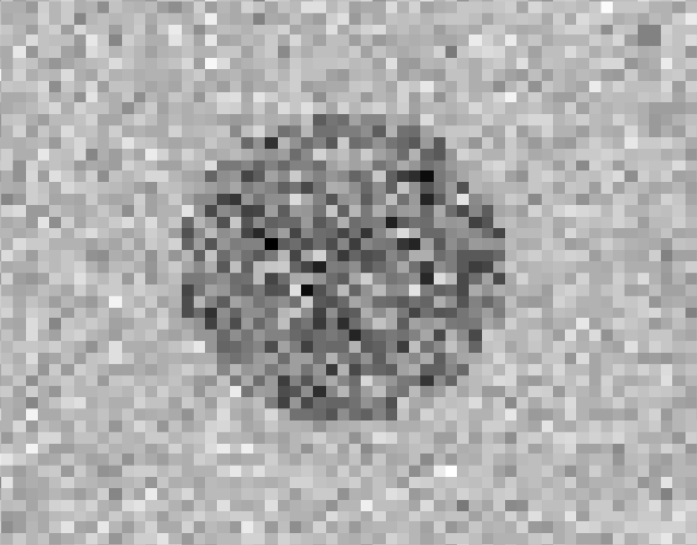
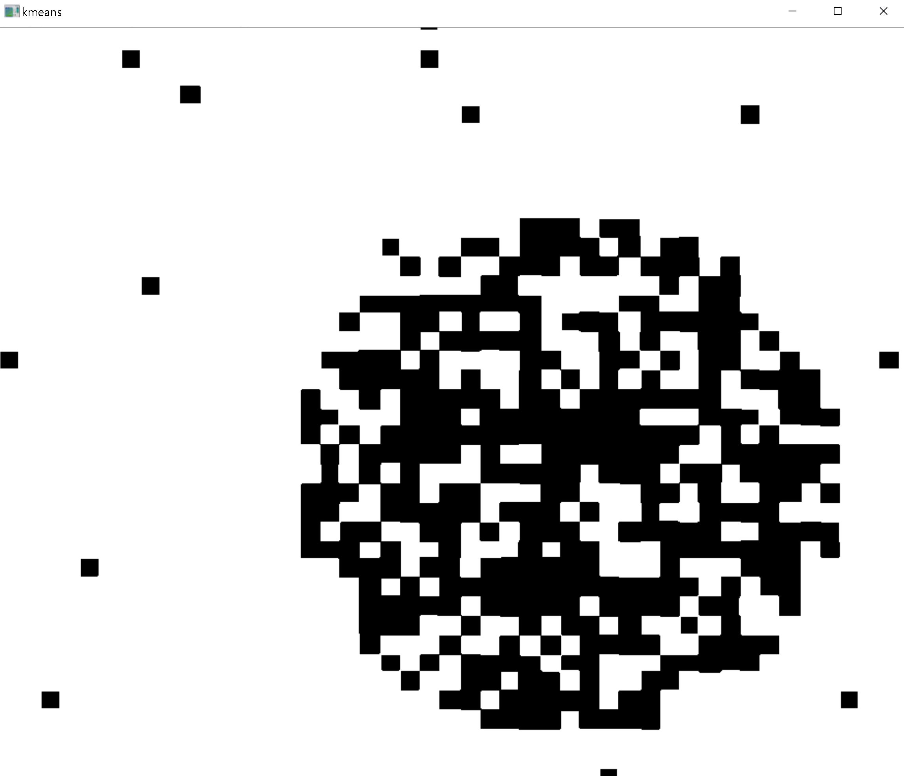
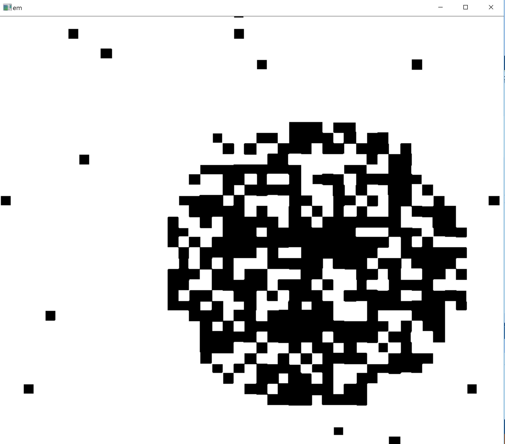
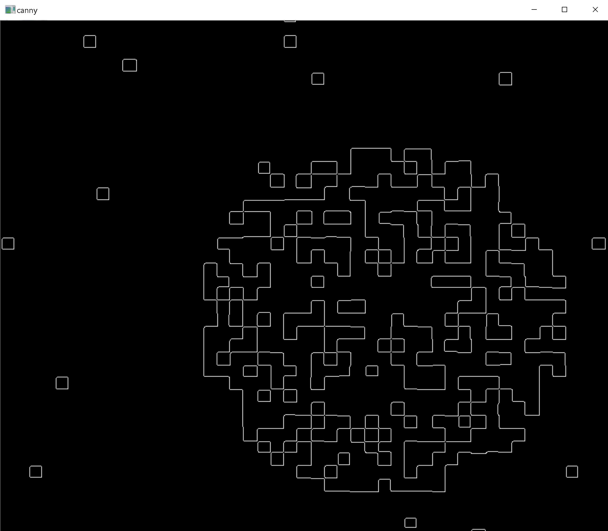
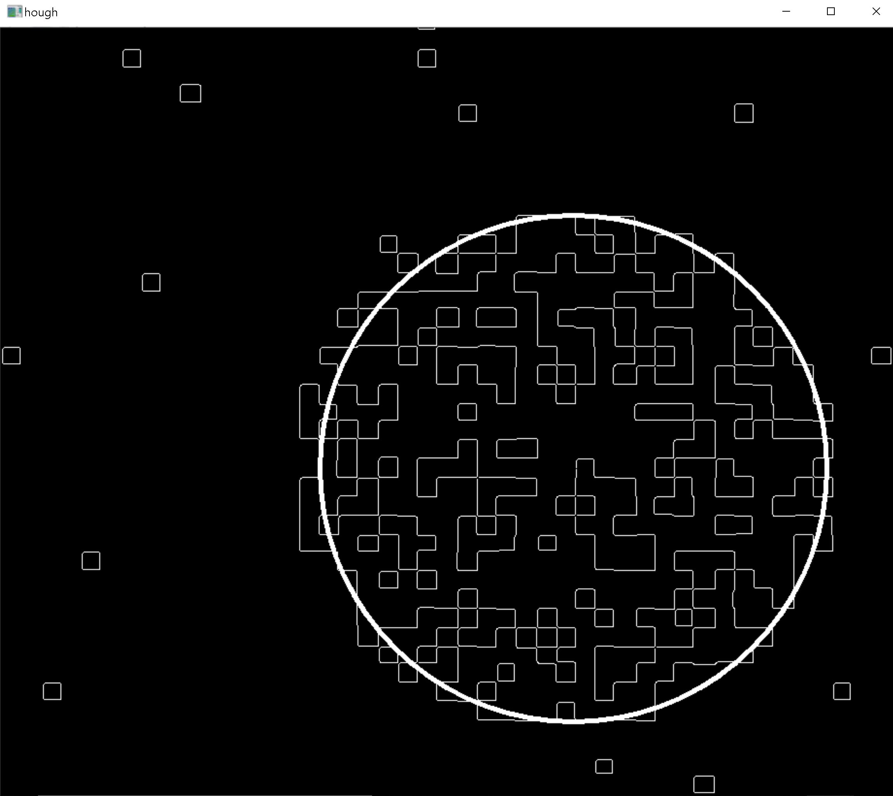

# segmentation-recognition

•	Implemented segmentation and recognition on a noisy image.
•	For Segmentation, implemented both K-Means and Expectation-Maximization algorithms on the image in C++ without using default methods provided.

